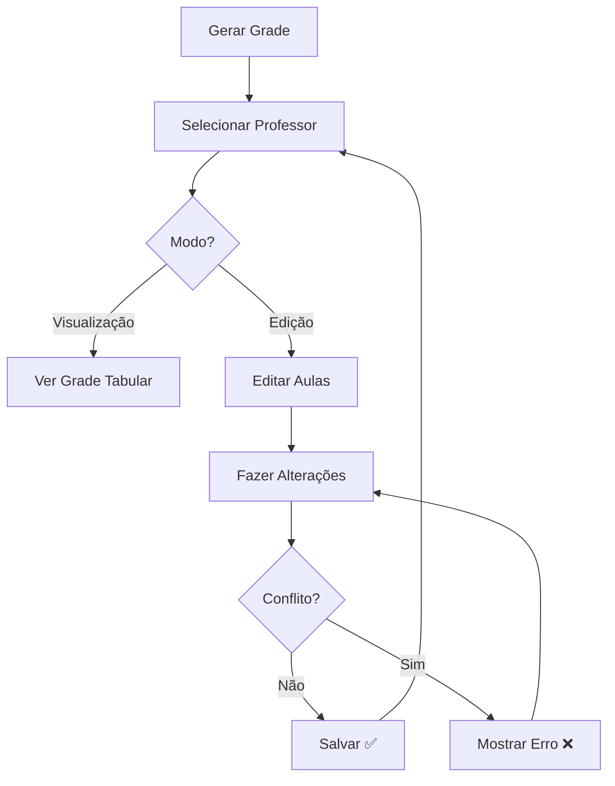

# 📅 GUIA: VISUALIZAÇÃO E EDIÇÃO DA GRADE

## ✨ NOVA FUNCIONALIDADE: Grade em Formato Calendário/Tabela

### 📊 Como Visualizar a Grade do Professor

1. **Gere a grade** (aba "🗓️ Gerar Grade")
2. **Vá para aba** "👨‍🏫 Grade por Professor"
3. **Selecione um professor** no dropdown

### 📅 Visualização em Formato de Grade Horária

A grade agora é mostrada em **formato de calendário/tabela semanal**:

```
┌──────────┬───────────┬───────────┬───────────┬───────────┬───────────┐
│ Horário  │    SEG    │    TER    │    QUA    │    QUI    │    SEX    │
├──────────┼───────────┼───────────┼───────────┼───────────┼───────────┤
│    1º    │ Física    │           │ Matemática│ Física    │           │
│          │ 1emA      │           │ 2emA      │ 1emB      │           │
│          │ 07:00     │           │ 07:00     │ 07:00     │           │
├──────────┼───────────┼───────────┼───────────┼───────────┼───────────┤
│    2º    │ Matemática│ Física    │           │ Matemática│ Física    │
│          │ 1emA      │ 2emA      │           │ 1emB      │ 2emA      │
│          │ 07:50     │ 07:50     │           │ 07:50     │ 07:50     │
└──────────┴───────────┴───────────┴───────────┴───────────┴───────────┘
```

**Cada célula mostra:**
- Nome da disciplina
- Turma
- Horário real (ex: 07:00, 08:40)

### ✏️ Como Editar Manualmente

1. **Ative "Modo Edição"** (checkbox no topo)
2. A visualização muda para **lista expansível**
3. **Clique em uma aula** para editar
4. **Ajuste:**
   - Dia (seg → ter)
   - Horário (1º → 3º)
   - Professor (trocar por outro)
5. **Salvar** ou **Excluir**

### 🔄 Alternar entre Modos

| Modo | Visualização | Ações |
|------|--------------|-------|
| **Visualização** (padrão) | 📅 Grade tabular | Apenas ver |
| **Edição** (ativado) | 📋 Lista expansível | Editar/Excluir |

---

## 💡 Casos de Uso

### Exemplo 1: Ver todas as aulas de um professor
```
1. Selecione "Professor Santiago"
2. Veja a grade semanal completa
3. Identifique buracos no horário
```

### Exemplo 2: Trocar aula de dia
```
Professor pede: "Física da 1emA de segunda para terça"

1. Selecione "Santiago"
2. Ative "Modo Edição" ✏️
3. Expanda "seg - 2º (07:50) | 1emA - Física"
4. Mude Dia: seg → ter
5. Salvar ✅
```

### Exemplo 3: Trocar professor de uma aula
```
"Cesar não pode dar aula na terça, Santiago assume"

1. Selecione "Cesar"
2. Ative "Modo Edição" ✏️
3. Expanda a aula de terça
4. Mude Professor: Cesar → Santiago
5. Salvar ✅
```

---

## 🛡️ Proteções Automáticas

O sistema **NÃO PERMITE** salvar se:

❌ **Conflito de turma:** Turma já tem aula naquele horário  
❌ **Conflito de professor:** Professor já tem aula naquele horário  
❌ **Professor incompatível:** Professor não ministra aquela disciplina

✅ **Apenas alterações válidas** são aceitas!

---

## 📋 Visualizações Disponíveis

### 1. Grade Tabular (Modo Visualização)
- ✅ Visão geral da semana
- ✅ Fácil identificar padrões
- ✅ Ver buracos no horário

### 2. Lista Detalhada (dentro de expander)
- ✅ Ver todas as informações
- ✅ Ordenado por dia e horário
- ✅ Exportável

### 3. Lista Editável (Modo Edição)
- ✅ Controles de edição
- ✅ Validação de conflitos
- ✅ Exclusão de aulas

---

## 🎯 Fluxo Completo



---

## 🚀 Teste Agora!

```bash
streamlit run app.py
```

1. Gere uma grade (aba 5)
2. Vá para "Grade por Professor" (aba 6)
3. Selecione um professor
4. **VER:** Grade tabular 📅
5. **EDITAR:** Ative modo edição ✏️

**Pronto para usar!** 🎉
